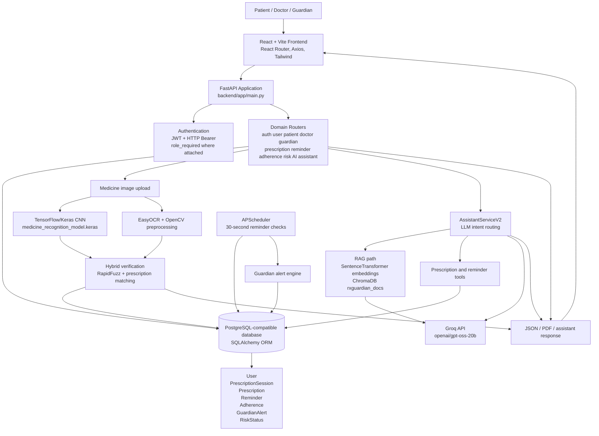

# RxGuardian - Technical Documentation

## 1. Project Overview

RxGuardian is a full-stack medication-management application implemented with a React frontend and a FastAPI backend. Its implemented workflows connect patients, doctors, and guardians around prescriptions, scheduled reminders, medicine-image verification, adherence reporting, and medicine-related assistance.

The application has three role concepts in the codebase: `patient`, `doctor`, and `guardian`. The frontend provides role-specific routes and layouts under `frontend/src/pages`, `frontend/src/layouts`, and `frontend/src/routes`. The backend exposes domain routers from `backend/app/main.py`.

The system uses AI in two concrete areas:

- Image-based medicine verification combines a TensorFlow/Keras image classifier with EasyOCR and prescription matching.
- The medicine assistant uses Groq-hosted LLM calls, structured medicine JSON data, ChromaDB retrieval, and database-backed prescription/reminder tools.

The primary backend data model is relational. SQLAlchemy models store users, prescription sessions, prescriptions, reminders, adherence logs, guardian alerts, and risk status. The frontend communicates with the API through Axios, using the configurable `VITE_API_BASE` value or the default API origin in `frontend/src/api/api.js`.

## 2. Problem Statement

Medication workflows in the application require more than displaying a prescription. The implemented system addresses four connected problems:

1. A patient needs to identify whether an uploaded medicine image corresponds to a known medicine and to a prescribed medicine.
2. A patient needs scheduled medication reminders and a way to record a dose as taken after verification.
3. Doctors need prescription creation and aggregate adherence visibility.
4. Guardians need patient status, adherence reports, and alerts when scheduled medicines become missed.

RxGuardian addresses these through prescription-linked reminder generation, CNN plus OCR verification, adherence calculations, background reminder processing, guardian alert creation, and conversational medicine assistance.

## 3. Key Features

### Role-based application flows

- Patient pages support today's medicines, medicine history, image upload, verification results, and the medicine assistant.
- Doctor pages support prescription creation and adherence analytics.
- Guardian pages support patient reports, status monitoring, charts, and active alerts.
- Frontend route and layout definitions are in `frontend/src/App.jsx`, `frontend/src/pages`, and `frontend/src/layouts`.

### Authentication and authorization

- `POST /auth/register` validates registration input with `RegisterSchema`, hashes passwords through `hash_password`, and stores a `User`.
- `POST /auth/login` validates credentials with `verify_password` and returns a JWT from `create_access_token`.
- `verify_token` decodes bearer tokens using `python-jose`.
- `role_required` enforces role checks where it is attached, such as `GET /patient/dashboard`.
- The Axios client adds a bearer token from browser `localStorage` when a token exists.

### Prescription and reminder generation

- `POST /prescriptions/create-session` creates a `PrescriptionSession`, one `Prescription` per medicine, and daily `Reminder` records for the requested duration.
- Prescription records contain medicine name, dosage, frequency, duration, timing, scheduled time, and dates.
- `GET /prescriptions/download/session/{session_id}` generates a prescription PDF through ReportLab.

### Medicine verification

- `POST /ai/verify-tablet/{patient_id}` and `POST /ai/verify-tablet-email/{email}` accept an uploaded image.
- `predict_medicine` loads `medicine_recognition_model.keras`, resizes the image to `224 x 224`, preprocesses it with TensorFlow EfficientNet preprocessing, and returns a class and confidence score.
- `extract_text` in `backend/ai_engine/ocr/ocr_engine.py` preprocesses the image with OpenCV and runs EasyOCR.
- `hybrid_predict` combines CNN output with OCR fuzzy matching using RapidFuzz.
- `verify_tablet_logic` applies a confidence gate and compares the normalized prediction with the patient's prescriptions.
- `POST /reminders/verify-and-take/{reminder_id}` marks a reminder as `taken` only when the verified medicine matches the reminder medicine.

### Reminders, adherence, and alerts

- `start_scheduler` registers APScheduler's `check_reminders` job at 30-second intervals during application startup.
- `check_reminders` increments notification stages, marks an overdue pending reminder as `missed` after 30 minutes, and calls `update_guardian_alerts`.
- `GET /adherence/patient/{patient_id}` and `GET /adherence/patient-email/{email}` calculate counts, percentage adherence, risk level, and history from reminder status.
- `GET /guardian/reports/{patient_id}` returns total, taken, missed, pending, adherence percentage, and risk level.
- `GuardianAlert` records active or resolved guardian alerts; duplicate active alerts for the same medicine are avoided by `update_guardian_alerts`.

### Medicine assistant and agent workflow

- `POST /medicine/analyze` accepts a session ID and image, runs CNN and OCR, then calls `MedicineAgentService.process`.
- The service can resolve low-confidence results, load medicine data from `medicine_data.json`, generate a Groq summary, and save the detected medicine in session memory.
- `POST /assistant/chat-v2` invokes `AssistantServiceV2.ask_ai`, which uses an LLM intent router and dispatches to RAG, prescription, or reminder processing.
- `prescription_tool.execute` returns active prescriptions for the current date.
- `reminder_tool.execute` returns reminder medicine names, times, statuses, and verification flags.
- `conversation_memory.py` stores current medicine, medicine history, last route, and last tool in process memory keyed by `session_id`.

## 4. Technology Stack

| Area | Technology | Evidence and implemented use |
|---|---|---|
| Language | Python | Backend routes, services, ORM models, AI pipeline, schedulers, and tests under `backend/`. |
| Frontend | React 19 | Components and pages under `frontend/src/`; frontend dependency declared in `frontend/package.json`. |
| Frontend build | Vite | `frontend/package.json` provides `vite`, `dev`, `build`, `lint`, and `preview` scripts. |
| Frontend routing | React Router | Application routing in `frontend/src/App.jsx`; dependency in `frontend/package.json`. |
| UI styling | Tailwind CSS | Utility classes throughout frontend pages; configured by `tailwind.config.js`. |
| HTTP client | Axios | Central client and interceptor in `frontend/src/api/api.js`; service calls under `frontend/src/services/`. |
| UI animation | Framer Motion | Used by landing pages and role dashboards; declared in `frontend/package.json`. |
| Charts | Recharts | Used by adherence chart components under `frontend/src/components/charts/`. |
| API framework | FastAPI | Application and router registration in `backend/app/main.py`. |
| Database | PostgreSQL-compatible SQLAlchemy connection | `DATABASE_URL` is loaded in `backend/app/config/database.py`; `psycopg2-binary` is listed in `backend/requirements.txt`. |
| ORM | SQLAlchemy 2.x | `Base`, `SessionLocal`, `get_db`, and ORM models under `backend/app/models/`. |
| Validation | Pydantic 2.x | `RegisterSchema`, `LoginSchema`, `AssistantRequest`, and other request models under `backend/app/schemas/`; some routes still accept raw `dict` bodies. |
| Authentication | JWT and HTTP Bearer | `python-jose`, `HTTPBearer`, `create_access_token`, and `verify_token`. |
| Password security | Passlib with bcrypt | `backend/app/utils/password_hash.py`; dependencies in `backend/requirements.txt`. |
| Role authorization | Custom RBAC dependency | `backend/app/middleware/role_middleware.py` provides `role_required`. |
| Image classification | TensorFlow/Keras | `predictor.py` loads `medicine_recognition_model.keras`; TensorFlow is in requirements. |
| Vision model | CNN classifier | The persisted Keras model predicts among labels in `medicine_class_labels.json`; the repository does not expose a training architecture definition in the application code. |
| Image processing | Pillow, NumPy, OpenCV | Image loading/resizing in `predictor.py`; preprocessing and OCR transforms use Pillow, NumPy, and OpenCV. |
| OCR | EasyOCR | `ocr_engine.py` creates an English EasyOCR reader with GPU detection. |
| Fuzzy matching | RapidFuzz | `hybrid_engine.py` uses `fuzz.partial_ratio` for OCR-to-medicine matching. |
| LLM provider | Groq API | Services instantiate `groq.Groq` using `GROQ_API_KEY`. |
| LLM model | `openai/gpt-oss-20b` | Used by RAG, JSON, summary, assistant, and tool-summary services; router/answer models can also be overridden by environment variables. |
| RAG embeddings | Sentence Transformers | `SentenceTransformer("all-MiniLM-L6-v2")` in `backend/app/rag/embeddings.py`. |
| Vector store | ChromaDB | Persistent collection `rxguardian_docs` under `app/rag/chroma_db`; retrieval requests `n_results=2`. |
| Structured knowledge base | JSON | `backend/ai_engine/data/medicine_data.json` is read by `KnowledgeBaseService` and JSON retrievers. |
| Tool workflow | Python service/tool modules | `AssistantServiceV2` dispatches to `rag`, `prescription`, and `reminder` paths; tools are under `backend/app/tools/`. |
| Scheduling | APScheduler | `reminder_scheduler.py` runs reminder checks every 30 seconds. |
| PDF generation | ReportLab | Prescription and guardian report routes import ReportLab PDF components. |
| Deployment configuration | Vercel SPA rewrite | `frontend/vercel.json` rewrites all paths to `/`; the workspace contains no Azure deployment manifest. |

## 5. Complete System Architecture

### Frontend layer

The React application is organized around public, authentication, patient, doctor, and guardian pages. `frontend/src/api/api.js` creates the Axios client and attaches a bearer token from `localStorage`. Services such as `authService.js`, `assistantApi.js`, and `medicineUploadApi.js` call backend endpoints.

### API and application layer

`backend/app/main.py` creates `FastAPI(title="RxGuardian API", version="2.0.0")`, configures CORS, starts the reminder scheduler during startup, and includes routers for authentication, users, patient, doctor, guardian, prescriptions, reminders, adherence, risk, alerts, AI verification, medicine analysis, assistant chat, and medicine chat.

### Authentication layer

Registration and login are implemented in `auth_routes.py`. `jwt_handler.py` creates expiring JWTs from environment-configured values. `jwt_middleware.py` verifies bearer tokens, and `role_middleware.py` checks the decoded `role` claim. The codebase does not attach JWT or role dependencies uniformly to every domain router; the route declaration is the source of truth for whether a specific endpoint is protected.

### Data layer

`database.py` creates the SQLAlchemy engine and session factory from `DATABASE_URL`. The main domain tables are represented by `User`, `PrescriptionSession`, `Prescription`, `Reminder`, `Adherence`, `GuardianAlert`, and `RiskStatus`. `get_db` yields a session and closes it in a `finally` block.

### AI and knowledge layer

The medicine verification path is:

`UploadFile` -> temporary file in `uploads/` -> TensorFlow/Keras prediction and EasyOCR -> hybrid confidence decision -> prescription comparison -> JSON result.

The assistant path is:

`AssistantServiceV2.ask_ai` -> Groq JSON intent classification -> route mapping -> RAG, prescription tool, or reminder tool -> tool/RAG result -> optional Groq summarization -> assistant response.

The repository also contains a simpler assistant path in `AssistantService` and direct medicine chat in `MedicineChatService`; these use structured medicine JSON and Groq prompts rather than the full V2 tool workflow.

### Reliability boundaries visible in code

- Uploaded verification files are removed in `finally` blocks after processing.
- CNN inference returns an `Unknown` result with zero confidence on an exception.
- EasyOCR returns an empty string when OCR fails.
- AI route errors return a verification-failure JSON response.
- The RAG and assistant prompts instruct the LLM not to diagnose, prescribe, or change treatment and to defer uncertain medical advice to a doctor or pharmacist.
- Database sessions created through `get_db` or `SessionLocal` are closed after use.

### Mermaid architecture diagram



## 6. Mermaid architecture diagram

The following focused diagram shows the implemented medicine-verification and assistant paths behind the API.

```mermaid
flowchart LR
    CLIENT[React client]
    VERIFY_API[POST /ai/verify-tablet/{patient_id}\nPOST /reminders/verify-and-take/{reminder_id}]
    AGENT_API[POST /medicine/analyze\nPOST /assistant/chat-v2]
    PRED[predict_medicine\nTensorFlow/Keras]
    OCR[extract_text\nEasyOCR + OpenCV]
    HYBRID[hybrid_predict / verify_tablet_logic]
    MATCH[Prescription or reminder match]
    ROUTER[llm_classify\nJSON intent output]
    RAG[retrieve -> ChromaDB\nall-MiniLM-L6-v2 embeddings]
    PTOOL[prescription_tool.execute]
    RTOOL[reminder_tool.execute]
    SUM[Groq summary / tool summary\nopenai/gpt-oss-20b]
    MEMORY[conversation_memory\nprocess-local session state]
    DB[(SQLAlchemy database)]
    OUT[JSON response]

    CLIENT --> VERIFY_API
    CLIENT --> AGENT_API
    VERIFY_API --> PRED
    VERIFY_API --> OCR
    PRED --> HYBRID
    OCR --> HYBRID
    HYBRID --> MATCH
    MATCH --> DB
    AGENT_API --> ROUTER
    AGENT_API --> MEMORY
    ROUTER --> RAG
    ROUTER --> PTOOL
    ROUTER --> RTOOL
    RAG --> SUM
    PTOOL --> DB
    RTOOL --> DB
    PTOOL --> SUM
    RTOOL --> SUM
    SUM --> OUT
    MATCH --> OUT
    OUT --> CLIENT
```

## 7. End-to-End Application Workflow

### 1. Frontend initialization and API calls

1. The user opens the Vite-built React application. Routes are defined in `frontend/src/App.jsx` for public pages, authentication, and role-specific areas.
2. `frontend/src/api/api.js` creates an Axios client. Its request interceptor reads `localStorage.token` and adds `Authorization: Bearer <token>` when present.
3. Feature services call the FastAPI backend. For example, `authService.js` calls `/auth/register` and `/auth/login`, `medicineUploadApi.js` calls `/medicine/analyze`, and `assistantApi.js` calls `/assistant/chat-v2`.

### 2. Registration and login

1. `Register.jsx` submits user data to `registerUser`.
2. `auth_routes.register_user` validates the request with `RegisterSchema`, checks for an existing email, hashes the password using bcrypt through Passlib, creates `User`, commits it, and returns a success message.
3. `Login.jsx` submits credentials to `/auth/login`.
4. `auth_routes.login_user` loads the user, verifies the password, and calls `create_access_token` with `user_id`, `email`, `role`, and an expiry claim.
5. The frontend stores the returned token and user data in `localStorage` and navigates to the selected role area.

### 3. Prescription creation and reminder materialization

1. A doctor submits the prescription form from `frontend/src/pages/Doctor/CreatePrescription.jsx`.
2. The frontend calls `POST /prescriptions/create-session` with patient email, doctor name, disease, and medicine entries.
3. `create_prescription_session` finds the patient, creates a `PrescriptionSession`, parses each duration, creates a `Prescription` with start and end dates, and creates one `Reminder` per day of treatment.
4. Those reminders become the source data for patient views, adherence calculations, scheduled checks, and guardian reports.

### 4. Patient reminder and verification flow

1. Patient pages request reminders through `/reminders/patient/{patient_id}` or `/reminders/patient-email/{email}`.
2. The frontend reminder utilities can display browser notifications using the Web Notification API. The backend also runs `check_reminders` every 30 seconds through APScheduler.
3. For a dose verification, `UploadMedicine.jsx` sends the image to `POST /reminders/verify-and-take/{reminder_id}`.
4. `verify_and_take` saves the upload temporarily and calls `verify_tablet_logic`.
5. `verify_tablet_logic` calls `hybrid_predict`, rejects predictions below the implemented 60-point confidence threshold, loads the patient's prescriptions, normalizes medicine names, and returns `Correct Medicine` only for a match.
6. When the predicted medicine also matches the reminder medicine, `verify_and_take` sets `Reminder.status` to `taken`, sets `medicine_verified` to `True`, commits the update, and resolves matching active guardian alerts. Otherwise, the reminder remains pending and the response reports a wrong medicine.

### 5. CNN and OCR processing

1. `predict_medicine` loads the Keras model and class labels at module initialization.
2. The uploaded image is converted to RGB, resized to `224 x 224`, converted to an array, expanded with a batch dimension, and passed through TensorFlow preprocessing and model prediction.
3. `ocr_engine.extract_text` loads the image with OpenCV, enlarges it three times, converts it to grayscale, applies Gaussian blur, histogram equalization, adaptive thresholding, and morphological closing, then calls EasyOCR with English language support and greedy decoding.
4. `hybrid_predict` calculates OCR medicine scores with RapidFuzz. It uses CNN/OCR agreement, an OCR threshold of `85`, and a CNN threshold of `80` to select the final prediction source.

### 6. Medicine analysis and assistant flow

1. The assistant image flow calls `POST /medicine/analyze` with `session_id` and a file.
2. `analyze_medicine` runs `predict_medicine`, `extract_text`, and `MedicineAgentService.process`.
3. `MedicineAgentService` checks OCR text against the CNN class, optionally calls `ResolverService` for low-confidence disagreement, loads structured medicine data through `KnowledgeBaseService`, and calls `GroqService.generate_summary` when data exists. It saves the detected medicine in `conversation_memory`.
4. For conversational questions, `POST /assistant/chat-v2` constructs a database session and invokes `AssistantServiceV2.ask_ai`.
5. `AssistantServiceV2` handles greetings, reads the current medicine from session memory, calls `llm_classify`, maps the returned intent to `json`, `rag`, `prescription`, or `reminder`, and saves the selected route.
6. The RAG route detects or extracts medicine context, calls `ask_rag`, embeds the query with `all-MiniLM-L6-v2`, retrieves two documents from the persistent `rxguardian_docs` ChromaDB collection, constructs a prompt, and calls Groq.
7. The prescription route calls `prescription_tool.execute`, which returns prescriptions active on the current date. The reminder route calls `reminder_tool.execute`, which returns reminder status and verification fields. Both routes use `ToolSummaryService` to convert returned data into a concise response.
8. The final assistant response is returned as JSON `{ "answer": ... }` to the React assistant component.

### 7. Missed-dose and guardian workflow

1. `check_reminders` reads today's reminders and skips those already marked `taken`.
2. At 0-10, 10-20, and 20-30 minutes after the scheduled time, it increments `notification_count` through three reminder stages.
3. At 30 minutes or later, an uncompleted reminder is marked `missed`, `guardian_notified` is set to `True`, and `update_guardian_alerts` creates an active `GuardianAlert` unless an active alert for that medicine already exists.
4. Guardian endpoints query reminder and alert records. `GuardianDashboard.jsx`, `Reports.jsx`, and `GuardianAlerts.jsx` display the resulting status, adherence, risk, and alert data.
5. The same reminder records feed `/adherence/...`, `/risk/patient/{patient_id}`, doctor analytics, and patient medicine history.

### 8. Response types

- Authentication, dashboard, verification, reminder, adherence, risk, alert, and assistant routes return JSON objects or lists.
- Prescription and guardian report routes use ReportLab to generate PDF files where the corresponding download endpoints are implemented.
- Temporary medicine images are deleted from `uploads/` in `finally` blocks after AI processing.

## 8. CNN + EasyOCR Medicine Verification Pipeline

### Implemented entry points

The primary API path is `POST /ai/verify-tablet/{patient_id}` or `POST /ai/verify-tablet-email/{email}` in `backend/app/routes/ai_routes.py`. The reminder-specific path is `POST /reminders/verify-and-take/{reminder_id}` in `backend/app/routes/reminder_routes.py`. Both save the uploaded `UploadFile` temporarily under `uploads/`, call `verify_tablet_logic`, and remove the file in a `finally` block.

### CNN inference

`backend/ai_engine/inference/predictor.py` loads `backend/ai_engine/model/medicine_recognition_model.keras` with `tensorflow.keras.models.load_model` and loads class names from `medicine_class_labels.json`. `predict_medicine(image_path, device="GPU")`:

1. Opens the image with Pillow and converts it to RGB.
2. Resizes it to `224 x 224`.
3. Converts it to an array, adds a batch dimension, and applies TensorFlow EfficientNet `preprocess_input`.
4. Calls `model.predict` inside `tf.device('/GPU:0')`.
5. Returns `medicine_name`, a percentage `confidence_score`, `raw_predictions`, and `device_used`.

The code enables TensorFlow GPU memory growth when a GPU is detected. The repository contains the trained `.keras` artifact and labels, but does not expose the CNN training architecture or evaluation metrics in the application source. Therefore, the model is documented as a persisted Keras CNN classifier, not as a specific backbone or measured production model.

### EasyOCR path

`backend/ai_engine/ocr/ocr_engine.py` creates `easyocr.Reader(['en'], gpu=GPU_ENABLED)`, where `GPU_ENABLED` is based on `torch.cuda.is_available()`. `extract_text(image_path)` uses OpenCV to enlarge the image by `3x`, convert it to grayscale, apply a `(5, 5)` Gaussian blur, histogram equalization, adaptive Gaussian thresholding with block size `11` and constant `2`, and morphological closing with a `2 x 2` kernel. It then calls EasyOCR with `detail=0`, `paragraph=True`, `batch_size=8`, and `decoder='greedy'`, returning normalized lowercase text or an empty string on error.

### Hybrid decision

`backend/ai_engine/inference/hybrid_engine.py` calls both `predict_medicine` and `extract_text`. It compares each known class in its `CLASS_NAMES` list with OCR text using RapidFuzz `partial_ratio`. The decision rules are:

- If OCR and CNN predict the same medicine, use the CNN/OCR agreement result and the higher score.
- Otherwise, use OCR when its score is at least `85`.
- Otherwise, use CNN when its confidence is at least `80`.
- Otherwise, retain the CNN result and label the source `LOW CONFIDENCE`.

The returned object includes the final medicine, confidence, prediction source, OCR prediction and score, CNN prediction and confidence, and device. `backend/app/utils/ai_helper.py::verify_tablet_logic` applies a separate safety gate: confidence below `60` returns `Not Matched`; otherwise it normalizes the predicted and prescribed names by lowercasing and removing spaces and underscores before exact comparison.

### Reminder decision

In `verify_and_take`, the hybrid result must first be `Correct Medicine` and then match the reminder's medicine name after the same normalization style. Only then does the route set `Reminder.status = "taken"` and `Reminder.medicine_verified = True`. A mismatch returns a response with `verified: false` and leaves the reminder pending.

### Alternate implementation

`backend/ai_engine/inference/verification_engine.py` contains a second verification implementation using explicit `MEDICINE_ALIASES` and `ai_engine.ocr.easyocr_engine.extract_text`. It is not the function used by the current `/ai` route, which imports `hybrid_predict` through `ai_helper.py`. The existence of this alternate module is implementation evidence, not evidence of two independently deployed verification services.

## 9. LLM Architecture

### Provider and model

The LLM integrations use the Groq Python client. Most services call the model string `openai/gpt-oss-20b`; `llm_router.py` reads `GROQ_ROUTER_MODEL` with that same default, and `tool_summary_service.py` reads `GROQ_ANSWER_MODEL` with that default. API credentials are loaded from environment variables and are not part of this documentation.

### Implemented LLM roles

The code uses the LLM in several bounded roles rather than one universal call:

- `llm_classify` in `backend/app/services/llm_router.py` classifies a user query and extracts explicitly named medicines. It requests JSON mode, uses `temperature=0`, `max_completion_tokens=256`, and `include_reasoning=False`.
- `ask_rag` in `backend/app/rag/rag_service.py` receives retrieved documents and generates a medicine-safety answer.
- `GroqService.generate_summary` generates a five-point medicine summary from structured JSON data with `temperature=0.2`.
- `ToolSummaryService.summarize` converts prescription or reminder tool data into a patient-friendly answer with `temperature=0` and `max_tokens=350`.
- `MedicineChatService.ask` and `AssistantService.ask_ai` are additional direct prompt-based medicine-chat paths.

### Inputs and outputs

Inputs are user text, current medicine context, retrieved documents, structured medicine data, or serialized tool results. Outputs are plain text except for `llm_classify`, which is parsed into a Python dictionary containing `intent`, `medicine_name`, and `medicine_names`. The router normalizes values, validates intent membership against `ALLOWED_INTENTS`, and returns a default result when the response is empty, invalid, or unusable. `AssistantServiceV2` returns an English fallback when the router reports `ROUTER_ERROR`.

### Actual architecture boundary

The repository implements multiple LLM call sites and one semantic router, but it does not implement multiple cooperating LLM agents. There is no evidence of agent-to-agent delegation, independent agent memory, or an agent supervisor. The accurate description is a single assistant orchestration service with specialized prompt and tool paths.

## 10. Embeddings

`backend/app/rag/embeddings.py` instantiates one Sentence Transformers model:

```python
SentenceTransformer("all-MiniLM-L6-v2")
```

`backend/app/rag/ingest.py` reads each file in `app/rag/documents`, encodes the complete file text with `embedding_model.encode(text)`, converts the vector to a list, and adds it to the ChromaDB collection `rxguardian_docs` using the filename as the ID. The code does not implement a separate chunking function, chunk size, overlap, metadata schema, or reranker. Each ingested file is treated as one document for indexing.

At query time, `backend/app/rag/retriever.py::retrieve` encodes the complete query with the same model, sends the embedding to ChromaDB, and requests `n_results=2`. Keeping the same embedding model for ingestion and query encoding is required by this implementation; changing it would require re-embedding the stored documents.

## 11. RAG Pipeline

### Knowledge sources

The vector RAG knowledge source is the text files under `backend/app/rag/documents`, persisted in `backend/app/rag/chroma_db` by `ingest.py`. A separate structured source is `backend/ai_engine/data/medicine_data.json`, loaded by `KnowledgeBaseService` or `json_retriever.py`. The JSON path is a structured retrieval-and-generation path, not the ChromaDB vector path.

### Query routing

There are two implemented routing layers:

- `backend/app/rag/query_classifier.py` uses keyword rules to return `rag` or `json` for the simpler `hybrid_assistant.py` flow.
- `backend/app/services/llm_router.py` performs semantic JSON intent classification for `AssistantServiceV2`. Safety, interactions, and missed-dose guidance map to the RAG route; medicine information maps to the JSON route; prescription and reminder intents map to database tools.

### Vector RAG execution

The implemented vector path is:

`question` -> `embedding_model.encode(question)` -> ChromaDB `collection.query(..., n_results=2)` -> two retrieved document strings -> `"\n\n".join(documents)` -> prompt construction in `ask_rag` -> Groq completion -> answer text.

`ask_rag` instructs the model to answer primarily from retrieved context, avoid invented facts, avoid diagnosis and prescribing, and advise consultation with a doctor or pharmacist when uncertain. The final response is the selected completion content; document IDs and retrieval scores are not returned to the frontend.

### Actual limitations and non-claims

The code does not implement chunk-level indexing, retrieval evaluation, citation output, reranking, hybrid lexical/vector retrieval inside `ask_rag`, or a configurable top-k value. It also does not prove that every file in the documents directory is clinically complete. Those are boundaries of the current implementation, not assumptions to present as existing capabilities.

## 12. Prompt Engineering

Prompt templates are defined directly in the service modules rather than in a separate prompt registry. The main patterns are:

- `llm_router.SYSTEM_PROMPT` defines a closed set of intents, explicit medicine extraction rules, and a JSON-only response contract.
- `rag_service.ask_rag` uses retrieved context plus the user question and gives safety instructions: use context first, do not invent, do not diagnose, do not prescribe or change treatment, and defer uncertainty to a professional.
- `AssistantService.ask_ai` adds current-medicine conversation context and restricts the assistant to medicine-related questions. It explicitly prohibits diagnosis, prescribing, and recommending medicine changes.
- `GroqService.generate_summary` constrains output to five named categories: usage, best time, dosage advice, precautions, and common side effects.
- `ToolSummaryService.summarize` tells the model to use only supplied tool data, list all relevant records, avoid exposing internal tools or APIs, and format prescription/reminder results for patients.

The prompts are therefore used for output structure, intent control, context grounding, and medical-safety boundaries. They are not a substitute for deterministic authorization or clinical validation: the code's actual hard checks are implemented separately in prescription matching, reminder updates, role dependencies where attached, and confidence thresholds.

## 13. Tool/Function Calling

### Implemented mechanism

The application does not use native OpenAI-style tool-call messages or a provider function-calling schema. Instead, the LLM returns a constrained intent JSON object, and Python code dispatches to ordinary functions based on that intent. The accurate description is LLM-guided tool/function dispatch.

### Database tools

| Tool | Function and input | Output |
|---|---|---|
| Prescription tool | `backend/app/tools/prescription_tool.py::execute(db, patient_id)`; filters `Prescription` records whose start and end dates contain the current date. | A list of dictionaries containing medicine name, dosage, frequency, duration, timing, and scheduled time. |
| Reminder tool | `backend/app/tools/reminder_tool.py::execute(db, patient_id)`; queries all `Reminder` records for the patient. | A list containing medicine name, scheduled time, status, and `medicine_verified`. |
| RAG tool | `backend/app/tools/rag_tool.py::execute(query)`; delegates to `ask_rag(query)`. | Generated RAG answer text. |

`AssistantServiceV2.ask_ai` directly imports and calls the prescription and reminder tools after mapping intents. It then calls `ToolSummaryService.summarize(question, data, tool_name)` to turn structured results into an answer. The separate `tool_router.py::route_tool` currently handles only the tool name `rag`; its comments describe possible future tools, but those comments are not implemented routing behavior. `verification_tool.py::execute` returns a placeholder connection message and is not used by the V2 assistant flow.

### Tool selection and execution

1. `llm_classify` receives the user query and returns a validated intent.
2. `AssistantServiceV2` maps that intent to `rag`, `prescription`, `reminder`, or `json`.
3. For prescription and reminder routes, Python supplies the database session and a `user_id` to the corresponding tool.
4. The returned list is optionally filtered by an explicitly named medicine.
5. `ToolSummaryService` receives the tool data and produces the final natural-language response.

The current `/assistant/chat-v2` route sets `user_id = 1` as a hard-coded placeholder and has its JWT dependency commented out. This is an important implementation limitation: the tool workflow exists, but the route does not currently derive the user identity from the authenticated request.

## 14. AI Agent Workflow

### Current assistant workflow

The main agent-like path is `POST /assistant/chat-v2` -> `AssistantServiceV2.ask_ai(session_id, message, user_id, db)`:

1. Normalize the message and answer greetings locally.
2. Read the current medicine from `conversation_memory`.
3. Call `llm_classify` for semantic intent and explicit medicine extraction.
4. Stop with a temporary-unavailability message if routing returns `ROUTER_ERROR`.
5. Map the semantic intent to the internal route and save it in session memory.
6. For RAG intents, detect or extract medicine context, enrich the query when appropriate, save the selected tool, retrieve context through `ask_rag`, and return the generated answer.
7. For prescription intents, execute `prescription_tool`, optionally filter by normalized medicine name, and call `ToolSummaryService`.
8. For reminder and adherence intents, execute `reminder_tool`, normalize the returned data and statuses, and summarize the result.
9. Return the final text in the route response as `{ "answer": ... }`.

The image-analysis workflow is a related but separate agent-style service: `POST /medicine/analyze` calls CNN and OCR, then `MedicineAgentService.process` applies OCR verification, optional `ResolverService.resolve` for low-confidence disagreement, structured knowledge lookup, Groq summarization, and session-memory update.

### Memory and state

`backend/app/services/conversation_memory.py` stores a process-local dictionary keyed by `session_id`. Each session may contain `current_medicine`, a medicine `history`, `last_route`, and `last_tool`. `save_medicine`, `save_route`, and `save_tool` update that dictionary; `get_medicine`, `get_route`, `get_tool`, and `get_history` read it; `clear_memory` deletes a session.

This is in-memory application state, not a database-backed conversation store. It is not shown to be shared across workers or persisted across restarts. Prescription and reminder facts remain in SQLAlchemy-managed database records, while conversational context is process-local.

### Agentic boundary

The code supports an agentic workflow in the practical sense of intent interpretation, context selection, conditional routing, tool execution, and response synthesis. It does not implement a multi-agent system: there are no multiple cooperating agents with separate goals, message protocols, or supervisor/worker orchestration. Describing RxGuardian as a single LLM-routed assistant with deterministic Python tools is consistent with the implementation.

## 15. FastAPI Backend Architecture

`backend/app/main.py` creates `FastAPI(title="RxGuardian API", version="2.0.0")`, adds `CORSMiddleware`, includes the domain routers, exposes `/` and `/health`, and starts the APScheduler reminder engine during startup. The application is divided into:

- `backend/app/routes/`: HTTP route handlers for authentication, users, patient, doctor, guardian, prescriptions, reminders, adherence, risk, alerts, AI verification, medicine analysis, assistant chat, and medicine chat.
- `backend/app/services/`: application services such as `AssistantServiceV2`, `MedicineAgentService`, `GroqService`, `ToolSummaryService`, and `KnowledgeBaseService`.
- `backend/app/models/`: SQLAlchemy ORM models.
- `backend/app/schemas/`: Pydantic request and response models for selected APIs.
- `backend/app/middleware/`: JWT verification and role checks.
- `backend/app/utils/`: password hashing, JWT creation, reminder scheduling, status calculation, AI verification, and guardian alert logic.
- `backend/app/config/database.py`: engine, `SessionLocal`, declarative `Base`, and the `get_db` dependency.

The code uses dependency injection for database sessions through `Depends(get_db)` on many routes. Some assistant code instead creates `SessionLocal()` directly and closes it in a `finally` block. Business logic is partly service-based and partly implemented directly in route functions, especially for reporting and prescription creation.

## 16. REST API Endpoints

The following table lists the implemented route decorators in the active FastAPI application. Authentication is shown as `JWT` only where the route declares `verify_token` or `role_required`; a router name alone does not provide authorization.

| Method | Endpoint | Purpose | Authentication in route code |
|---|---|---|---|
| GET | `/` | Backend running message. | None declared |
| GET | `/health` | Health response for the backend. | None declared |
| POST | `/auth/register` | Create a user after duplicate-email check and password hashing. | None declared |
| POST | `/auth/login` | Verify credentials and issue an access token. | None declared |
| GET | `/user/me` | Return the decoded authenticated-user payload. | JWT |
| GET | `/patient/dashboard` | Patient dashboard response. | JWT + patient role |
| GET | `/doctor/patients` | List patients and calculate reminder-based adherence/risk values. | None declared |
| GET | `/doctor/analytics` | Return patient count, average adherence, high-risk count, and missed count. | None declared |
| GET | `/guardian/patient-status/{patient_id}` | Return a patient's reminder status list. | None declared |
| GET | `/guardian/patient-status-email/{email}` | Resolve a patient through guardian email and return status. | None declared |
| GET | `/guardian/reports/{patient_id}` | Return taken, missed, pending, adherence, and risk summary. | None declared |
| GET | `/guardian/reports-email/{email}` | Return a guardian's patient report by email. | None declared |
| GET | `/guardian/profile-email/{email}` | Return guardian-related profile lookup data. | None declared |
| GET | `/guardian/alerts/{patient_id}` | Return active guardian alerts for a patient. | None declared |
| GET | `/guardian/alerts-email/{email}` | Return active alerts resolved from guardian email. | None declared |
| GET | `/guardian/alert-history-email/{email}` | Return alert history lookup by guardian email. | None declared |
| POST | `/prescriptions/create-session` | Create a prescription session, prescriptions, and daily reminders. | None declared |
| GET | `/prescriptions/patient/{patient_id}` | Return prescriptions for a patient. | None declared |
| GET | `/prescriptions/patient-email/{email}` | Return prescriptions resolved by patient email. | None declared |
| GET | `/prescriptions/download/session/{session_id}` | Generate/download a prescription PDF. | None declared |
| GET | `/reminders/patient/{patient_id}` | Return a patient's reminders. | None declared |
| GET | `/reminders/patient-email/{email}` | Return today's reminders by patient email. | None declared |
| POST | `/reminders/verify-and-take/{reminder_id}` | Verify an uploaded medicine and mark the reminder taken on a match. | None declared |
| GET | `/adherence/patient/{patient_id}` | Calculate adherence summary and history. | None declared |
| GET | `/adherence/patient-email/{email}` | Calculate adherence summary by email. | None declared |
| GET | `/risk/patient/{patient_id}` | Return the first stored `RiskStatus` record. | None declared |
| POST | `/ai/verify-tablet/{patient_id}` | Run image-based medicine verification for a patient. | None declared |
| POST | `/ai/verify-tablet-email/{email}` | Run image-based verification after email lookup. | None declared |
| POST | `/medicine/analyze` | Run CNN/OCR analysis and generate a medicine response. | None declared |
| POST | `/medicine-chat/ask` | Ask a question against structured medicine data. | None declared |
| POST | `/assistant/chat` | Use the original direct assistant service. | None declared |
| POST | `/assistant/set-context` | Save a medicine in process-local conversation memory. | None declared |
| POST | `/assistant/chat-v2` | Run LLM intent routing and assistant orchestration. | JWT dependency is commented out |
| GET | `/test/guardian-alert/{patient_id}` | Invoke guardian-alert processing for testing. | None declared |

Request validation is mixed: authentication and assistant requests use Pydantic models such as `RegisterSchema`, `LoginSchema`, and `AssistantRequest`, while some endpoints accept raw dictionaries or form/file inputs. Responses are primarily JSON; PDF endpoints use FastAPI `FileResponse`.

## 17. PostgreSQL + SQLAlchemy Database

### Connection and session handling

`backend/app/config/database.py` loads `DATABASE_URL` with `python-dotenv`, creates a SQLAlchemy engine, constructs `SessionLocal` with `autocommit=False` and `autoflush=False`, and provides `get_db()` as a generator dependency that closes each session in `finally`. `psycopg2-binary` is present in `backend/requirements.txt`, supporting the configured PostgreSQL connection. The exact deployed database provider is not established by the application code itself.

### Tables and stored data

| ORM class | Table | Important data |
|---|---|---|
| `User` | `users` | Identity, unique email, bcrypt hash, role, and guardian contact fields. |
| `PrescriptionSession` | `prescription_sessions` | Patient, doctor name, disease, and creation time. |
| `Prescription` | `prescriptions` | Session, doctor/patient IDs, medicine, dosage, frequency, duration, timing, schedule, and date range. |
| `Reminder` | `reminders` | Patient/prescription IDs, medicine, date/time, status, notification count, guardian-notified flag, verification flag, and timestamps. |
| `Adherence` | `adherence_logs` | Patient/reminder IDs, medicine, status, and timestamp. |
| `GuardianAlert` | `guardian_alerts` | Patient ID, alert message, risk level, status, and creation time. |
| `RiskStatus` | `risk_status` | Patient ID, missed count, risk level, recommendation, and update time. |

Foreign keys are declared from `Prescription` to `prescription_sessions` and `users`, from `Reminder` to `users` and `prescriptions`, from `Adherence` to `users` and `reminders`, and from `RiskStatus` to `users`. `GuardianAlert.patient_id` is an integer column without a declared foreign key in the model. The code uses explicit queries and does not define SQLAlchemy relationship properties.

### Database flow

Prescription creation commits a session, then commits each prescription and its generated daily reminders. Verification queries prescriptions and updates the reminder on a successful match. Scheduler processing updates reminder state and creates alerts. Reporting routes calculate summaries by querying reminders; the adherence route does not create `Adherence` rows as part of the shown verification flow.

`backend/app/database/init_db.py` calls `Base.metadata.create_all(bind=engine)`. The migration `backend/app/migrations/add_reminder_date.py` adds the `reminder_date` column if it is absent.

## 18. JWT Authentication + RBAC

### Implemented flow

1. `auth_routes.register_user` accepts `RegisterSchema`, checks email uniqueness, hashes the password through `passlib.context.CryptContext` with bcrypt, and stores the hash in `User.password`.
2. `auth_routes.login_user` loads the user, calls `verify_password`, and creates a JWT with `user_id`, `email`, `role`, and an expiration claim through `create_access_token`.
3. `jwt_middleware.verify_token` uses `HTTPBearer`, decodes the token with `python-jose`, `SECRET_KEY`, and `ALGORITHM`, and raises HTTP 401 for `JWTError`.
4. `role_middleware.role_required(allowed_roles)` checks `user["role"]` and raises HTTP 403 when the role is not allowed.
5. `GET /user/me` requires `verify_token`; `GET /patient/dashboard` requires `role_required(["patient"])`.

The supported registration roles are the Pydantic literals `patient`, `doctor`, and `guardian`. The frontend stores login data in `localStorage` and the Axios interceptor sends the token when it exists.

### Security boundary shown by the code

JWT and RBAC utilities exist, but the route declarations do not apply them uniformly. Several doctor, guardian, prescription, reminder, AI, and assistant routes have no JWT or role dependency in the source. In particular, `/assistant/chat-v2` comments out `verify_token` and uses `user_id = 1`. This is a current access-control limitation, not a capability to claim as fully enforced RBAC.

## 19. Medication Reminder and Adherence Workflow

### Reminder creation

`create_prescription_session` parses each medicine duration, sets `start_date` to the current date, computes `end_date`, persists a `Prescription`, and creates one `Reminder` row per treatment day. Each reminder starts as `pending`, with `notification_count=0`, `guardian_notified=False`, and `medicine_verified=False`.

### Reminder processing

`start_scheduler` in `reminder_scheduler.py` registers `check_reminders` with APScheduler at a 30-second interval. For today's reminders, the active scheduler:

- skips reminders already marked `taken`;
- increments notification count during 0-10, 10-20, and 20-30 minutes after the scheduled time;
- marks a still-uncompleted reminder `missed` after 30 minutes;
- sets `guardian_notified=True`;
- calls `update_guardian_alerts`; and
- commits the batch and calls `cleanup_old_alerts`.

The repository also contains `status_engine.py` and `advanced_reminder_scheduler.py` with alternate reminder logic. Those modules use different timing thresholds and are not the startup scheduler path shown in `main.py`; they should not be represented as separate simultaneously active engines.

### Taking and verifying a dose

`POST /reminders/verify-and-take/{reminder_id}` calls `verify_tablet_logic`, requires both `Correct Medicine` and a normalized match with the reminder's medicine, then commits `taken` and `medicine_verified=True`. It resolves matching active guardian alerts. A wrong medicine returns `verified=False` and leaves the reminder pending.

### Adherence and risk

`GET /adherence/...` counts reminder rows with statuses `taken`, `missed`, and `pending`, calculates `taken / total * 100`, and assigns `MONITORING`, `LOW`, `MEDIUM`, or `HIGH`. `doctor_routes.py` calculates related doctor analytics, using less-than-80 and less-than-50 thresholds for patient risk. `guardian_routes.py` calculates the guardian report from reminder counts. `adherence_engine.calculate_adherence` is an additional utility that calculates the taken percentage.

### Guardian escalation

`update_guardian_alerts` creates a `GuardianAlert` with risk level `High` and a message containing the medicine, scheduled time, missed time, and date. It first searches for an active alert containing the medicine name to avoid duplicate active alerts. Guardian dashboards read these records through `/guardian/alerts...` and `/guardian/reports...`.

## 20. Error Handling

The implementation uses several local error-handling patterns:

- Authentication raises FastAPI `HTTPException` with 400 for duplicate registration, 401 for invalid credentials or invalid/expired JWTs, and 403 for a failed role check.
- Missing patients in prescription creation raise 404. Several lookup routes return an empty list or a status object when a patient is not found.
- CNN inference catches exceptions and returns `medicine_name="Unknown"`, `confidence_score=0.0`, and an error field.
- OCR catches image/reader errors, logs the error, and returns an empty string.
- AI upload routes catch processing exceptions, return a verification-failure response, and delete temporary files in `finally`.
- Reminder retrieval catches database/query exceptions and returns an empty list. Scheduler and status utilities catch time-format, per-reminder, and scheduler-level exceptions, log them, and close sessions.
- The LLM router handles empty or invalid JSON responses with a default result. `AssistantServiceV2` returns a temporary-unavailability message for `ROUTER_ERROR`.
- `ToolSummaryService` catches Groq rate-limit errors and general exceptions and returns a user-facing fallback. Other direct Groq services do not expose the same explicit wrapper.
- `get_db` and `chat-v2` close database sessions in `finally` blocks.

The code does not show a centralized exception handler, structured application logging, retry policy for all external calls, request-size validation, or comprehensive transaction rollback handling for every multi-step database operation.

## 21. Security and AI Safety

### Safeguards currently implemented

- Passwords are hashed with Passlib bcrypt and are not returned in the login payload.
- JWT expiration is added by `create_access_token`, and invalid token decoding raises HTTP 401.
- Pydantic role literals restrict registration roles to `patient`, `doctor`, and `guardian`.
- `role_required` provides an explicit authorization check where used.
- Image verification has a confidence gate below `60` and requires prescription matching before returning `Correct Medicine` from `verify_tablet_logic`.
- A reminder is marked taken only after the AI result matches the expected reminder medicine.
- Uploaded images are removed after processing through `finally` blocks.
- RAG, assistant, and tool-summary prompts tell the LLM not to diagnose, prescribe, change treatment, or invent facts, and to advise consulting a doctor or pharmacist when uncertain.
- Tool summaries are instructed to use only supplied data and not expose internal tools, APIs, or databases.

### Current security and safety gaps

- CORS is configured with `allow_origins=["*"]`, `allow_methods=["*"]`, and `allow_headers=["*"]`.
- Many domain endpoints do not declare JWT or role dependencies.
- `/assistant/chat-v2` has its JWT dependency commented out and uses a hard-coded `user_id = 1`.
- The code stores the browser token in `localStorage`; the repository does not show an HttpOnly-cookie flow.
- File names are used directly when constructing temporary upload paths; the code does not show content-type, size, or filename sanitization before writing.
- Prompt instructions reduce unsafe generation but do not replace clinical review, model calibration, or output validation.

These are current implementation observations. They are not claims that the application is HIPAA compliant or production-hardened.

## 22. Azure VM + Vercel Deployment

### Evidence present in the workspace

- `frontend/vercel.json` contains an SPA rewrite from `/(.*)` to `/`, supporting client-side Vite/React routes on Vercel.
- `frontend/src/api/api.js` uses `VITE_API_BASE` and falls back to `https://api.rxguardian.xyz`.
- The backend loads `DATABASE_URL`, JWT configuration values, and Groq configuration from environment variables with `python-dotenv`.
- `backend/requirements.txt` includes `uvicorn`, which is the ASGI server dependency for running the FastAPI application.

### Azure qualification

The workspace does not contain an Azure VM deployment script, ARM/Bicep/Terraform file, Dockerfile, systemd unit, Nginx configuration, or VM provisioning document. Therefore, an Azure VM may be an intended or external hosting choice, but the repository does not provide evidence to describe it as a verified current deployment. The code supports a split deployment shape in which the React frontend is hosted through Vercel and the FastAPI backend runs as a separate service, but the backend host and database host are not defined by repository deployment manifests.

### Environment and production configuration

The application expects environment-driven values for the database URL, JWT secret and algorithm, token expiry, Groq API key, and optional Groq model names. Secret values are not included here. The code does not show a production secrets manager, TLS configuration, container image, health-based orchestration, or automated deployment pipeline.

## 23. Current Limitations

The following limitations are directly visible in the implementation:

- JWT/RBAC dependencies are not applied consistently across domain routes.
- `/assistant/chat-v2` uses a hard-coded user ID and does not currently depend on the JWT verifier.
- The assistant session memory is a process-local dictionary and is not durable or multi-worker shared.
- RAG ingestion embeds complete files; no application-level chunking, metadata filtering, reranking, citations, or retrieval evaluation is implemented.
- The persisted CNN model is present, but its training code, dataset pipeline, calibration, and performance metrics are not exposed in the application repository.
- CNN/OCR verification uses fixed thresholds and name matching; it does not show human review or a calibrated abstention workflow beyond the low-confidence result.
- Several reminder engines/utilities coexist, while only `reminder_scheduler.start_scheduler` is wired into application startup.
- Some multi-step writes commit inside loops, and centralized rollback/error handling is not visible.
- CORS is permissive, and upload validation/sanitization is limited in the shown routes.
- The workspace provides Vercel SPA configuration but no verified Azure VM deployment configuration.

## 24. FUTURE Improvements

The following are recommendations, not current features:

- **FUTURE:** Apply JWT and role dependencies consistently to every patient, doctor, guardian, prescription, reminder, AI, and assistant endpoint; derive tool identity from the authenticated user instead of `user_id = 1`.
- **FUTURE:** Move conversation memory to a durable, user-scoped store with expiration and multi-worker coordination.
- **FUTURE:** Add chunking, metadata, citations, retrieval benchmarks, reranking, and evaluation datasets to the ChromaDB RAG pipeline.
- **FUTURE:** Add calibrated confidence thresholds, held-out evaluation, image-quality checks, and human-in-the-loop review for uncertain medicine recognition.
- **FUTURE:** Consolidate reminder scheduling into one tested engine and use an explicit background-job deployment model.
- **FUTURE:** Add centralized exception handlers, structured logging, retries with bounded backoff, transaction rollback, audit events, and health/readiness checks.
- **FUTURE:** Restrict CORS, validate upload content and size, sanitize file names, and use a production secret-management and TLS strategy.
- **FUTURE:** Add native provider tool schemas or a typed tool registry if strict function-calling contracts are required; the current implementation uses Python dispatch after LLM intent JSON.
- **FUTURE:** Add observability and evaluation for LLM routing, tool selection, RAG grounding, and unsafe-response handling.
- **FUTURE:** Add an explicit Azure VM deployment manifest or containerized deployment if Azure is the chosen backend host; alternatively document the actual backend hosting provider.
- **FUTURE:** Optimize model loading and GPU/CPU inference for a controlled serving process and measure latency only after representative benchmarking.
- **FUTURE:** Add cooperating agents only if a real multi-agent requirement emerges; the current single-orchestrator design should not be relabeled as multi-agent.

## 25. FlytBase Role Relevance

| FlytBase-relevant capability | RxGuardian implementation | Evidence |
|---|---|---|
| Python | Backend API, services, tools, schedulers, ORM, and AI modules. | `backend/app/`, `backend/ai_engine/`, `backend/requirements.txt` |
| LLM integration | Groq completions for routing, RAG answers, summaries, and tool-result narration. | `llm_router.py`, `rag_service.py`, `groq_service.py`, `tool_summary_service.py` |
| RAG | Query embedding, ChromaDB retrieval, context construction, and grounded prompt. | `app/rag/embeddings.py`, `retriever.py`, `rag_service.py` |
| Embeddings | Sentence Transformers `all-MiniLM-L6-v2`. | `app/rag/embeddings.py` |
| Tool calling concepts | LLM intent JSON selects Python RAG, prescription, or reminder paths. | `AssistantServiceV2`, `app/tools/` |
| Agentic AI | Single assistant orchestrates routing, memory, retrieval, database tools, and response synthesis. | `assistant_service_v2.py`, `conversation_memory.py` |
| Computer vision | Uploaded image preprocessing, CNN classification, and OCR. | `predictor.py`, `ocr_engine.py`, `hybrid_engine.py` |
| CNN / TensorFlow | Persisted Keras medicine classifier and TensorFlow inference. | `medicine_recognition_model.keras`, `predictor.py` |
| OCR | EasyOCR with OpenCV preprocessing and RapidFuzz matching. | `ocr_engine.py`, `medicine_text_match.py`, `hybrid_engine.py` |
| FastAPI | REST API, dependency injection, file uploads, and router composition. | `app/main.py`, `app/routes/` |
| REST APIs | Authentication, medication, analytics, AI, assistant, and guardian endpoints. | `app/routes/` |
| PostgreSQL / SQLAlchemy | Relational persistence through SQLAlchemy and configured database URL/driver. | `config/database.py`, `models/`, `requirements.txt` |
| Cloud deployment | Frontend SPA rewrite and configurable backend origin; external deployment evidence is partial. | `frontend/vercel.json`, `frontend/src/api/api.js` |
| AI safety | Confidence gate, prescription match, prompt restrictions, uncertain-answer fallback. | `ai_helper.py`, `rag_service.py`, assistant services |
| Production judgment | Explicit handling of unprotected routes, hard-coded assistant identity, and absent Azure manifest. | Route dependencies and deployment files |

The strongest role alignment is practical integration: the project connects model inference, retrieval, LLM routing, deterministic tools, APIs, persistence, and safety checks into one working application. The code demonstrates agentic orchestration, but not a multi-agent system.

## 26. 2-minute Interview Explanation

RxGuardian is a full-stack medication safety and adherence application. I built a React frontend with role-specific patient, doctor, and guardian workflows and a FastAPI backend that exposes prescription, reminder, adherence, guardian-alert, medicine-verification, and assistant APIs.

The core computer-vision workflow starts when a patient uploads a medicine image. The backend saves it temporarily, runs a TensorFlow/Keras classifier loaded from `medicine_recognition_model.keras`, and maps the output using the repository's medicine labels. In parallel, EasyOCR extracts text after OpenCV preprocessing. `hybrid_predict` combines the CNN result with RapidFuzz OCR matching using explicit thresholds and returns the prediction source and confidence. `verify_tablet_logic` then applies a low-confidence gate and compares the normalized medicine name with the patient's prescriptions. A dose is marked taken only when the verification result matches the reminder medicine.

The conversational assistant is a single orchestrator, not a multi-agent system. `AssistantServiceV2` sends the user query to a Groq-based JSON intent router. Based on the validated intent, Python dispatches to a RAG path, a prescription tool, a reminder tool, or a structured medicine path. RAG uses `all-MiniLM-L6-v2` embeddings and a persistent ChromaDB collection, retrieves two documents, constructs a safety-constrained prompt, and calls Groq again. Prescription and reminder tools read current SQLAlchemy records, and `ToolSummaryService` turns the structured results into a concise response. Conversation state stores the current medicine and last route/tool in a process-local dictionary.

The backend persists users, prescriptions, reminders, adherence-related data, alerts, and risk status through SQLAlchemy and a configured PostgreSQL-compatible connection. APScheduler checks today's reminders every 30 seconds, escalates a pending dose to missed after 30 minutes, and creates a guardian alert. JWT and role-checking utilities exist, but I would describe route protection as incomplete because the code does not attach those dependencies uniformly and `/assistant/chat-v2` currently uses a placeholder user ID. Deployment evidence includes a Vercel SPA rewrite and configurable API origin; an Azure VM manifest is not present in the repository. The project is relevant to an Agentic AI Engineer role because it demonstrates end-to-end integration of vision, retrieval, LLM routing, deterministic tools, APIs, databases, and safety boundaries.

## 27. 25 Technical Interview Questions with Concise Answers

### 1. Why does RxGuardian use both CNN inference and OCR?

The CNN classifies the visual medicine image, while EasyOCR extracts visible package text. `hybrid_predict` uses agreement and confidence rules so the system is not dependent on only one signal.

### 2. What preprocessing does the CNN path use?

`predict_medicine` converts the image to RGB, resizes it to `224 x 224`, converts it to an array, adds a batch dimension, and applies TensorFlow EfficientNet `preprocess_input` before Keras inference.

### 3. What does the CNN return?

It returns the predicted label, confidence as a percentage, raw prediction probabilities, and `device_used`. On an exception it returns `Unknown`, zero confidence, and an error field.

### 4. What does the OCR preprocessing do?

`ocr_engine.extract_text` enlarges the image, converts it to grayscale, blurs it, equalizes contrast, applies adaptive thresholding, performs morphological closing, and calls EasyOCR with English text recognition.

### 5. How is the hybrid prediction selected?

OCR/CNN agreement wins; OCR wins at score `>=85`; CNN wins at confidence `>=80`; otherwise the CNN result is returned as `LOW CONFIDENCE`.

### 6. What prevents a low-confidence image from being accepted?

`verify_tablet_logic` returns `Not Matched` when the hybrid confidence is below `60`, before prescription comparison can produce a successful verification.

### 7. How is prescription validation performed?

The patient's prescriptions are queried from SQLAlchemy and the predicted and prescribed names are lowercased with spaces and underscores removed before exact comparison.

### 8. What is the FastAPI application entry point?

`backend/app/main.py` creates the FastAPI instance, configures CORS, includes routers, exposes health endpoints, and starts the reminder scheduler during startup.

### 9. How are database sessions managed?

`get_db` creates a `SessionLocal` session, yields it to the route, and closes it in `finally`. The V2 assistant creates and closes its own `SessionLocal` session.

### 10. How is the database modeled?

SQLAlchemy models represent users, prescription sessions, prescriptions, reminders, adherence logs, guardian alerts, and risk status, with foreign keys linking prescriptions, reminders, adherence records, and users.

### 11. How does the reminder engine detect a missed dose?

The active `check_reminders` scheduler compares the current time with today's scheduled reminder time, increments notification stages, and marks an uncompleted reminder missed after 30 minutes.

### 12. How is adherence calculated?

The adherence route counts reminder rows with `taken`, `missed`, and `pending` statuses and calculates `taken / total * 100`. It assigns `MONITORING`, `LOW`, `MEDIUM`, or `HIGH` based on that result.

### 13. How are guardians notified?

When a reminder becomes missed, `update_guardian_alerts` creates an active `GuardianAlert` with medicine, schedule, missed time, date, and high risk level, while avoiding duplicate active alerts for the same medicine.

### 14. How does JWT authentication work?

Login verifies the bcrypt password hash and creates a JWT containing user ID, email, role, and expiry. `verify_token` decodes bearer tokens with `python-jose` and returns HTTP 401 on JWT errors.

### 15. How is RBAC implemented?

`role_required` wraps `verify_token`, checks the decoded `role` against an allowed-role list, and raises HTTP 403 on mismatch. It is used by the patient dashboard, but not uniformly across all domain routes.

### 16. What embedding model is used?

`SentenceTransformer("all-MiniLM-L6-v2")` encodes both documents during ingestion and user queries during retrieval.

### 17. Does the RAG pipeline chunk documents?

No. `ingest.py` reads each file as one complete text, creates one embedding, and stores it in ChromaDB under the filename. Chunking and overlap are not implemented in the shown code.

### 18. How many documents does retrieval request?

`retriever.py` calls ChromaDB with `n_results=2` and returns the first result document list.

### 19. What is the LLM used for in the assistant?

Groq calls classify intent, answer retrieved-context questions, summarize structured medicine data, and narrate prescription/reminder tool results. The configured default model string is `openai/gpt-oss-20b`.

### 20. Is RxGuardian a multi-agent system?

No. It has one assistant orchestrator, `AssistantServiceV2`, with conditional routing to RAG and Python tools. The code does not contain multiple cooperating agents or supervisor-worker communication.

### 21. Is native model function calling implemented?

No. The LLM returns intent JSON and Python performs the dispatch. The `app/tools` modules are ordinary Python functions, not provider-native tool-call messages.

### 22. What state does the assistant remember?

`conversation_memory.py` stores current medicine, medicine history, last route, and last tool by session ID in a process-local dictionary. It is not a durable database-backed memory system.

### 23. What prompt safety rules are present?

RAG and assistant prompts instruct the LLM not to diagnose, prescribe, change treatment, or invent facts, and to recommend consulting a doctor or pharmacist when uncertain. Tool summaries are restricted to supplied data.

### 24. What are the most important production security gaps?

Route protection is incomplete, CORS allows all origins, assistant identity is hard-coded in V2, browser tokens use localStorage, and upload validation/sanitization is not comprehensively implemented.

### 25. What deployment evidence is actually in the repository?

The frontend has a Vercel SPA rewrite and a configurable API base URL. The backend has environment-driven configuration and a Uvicorn dependency, but no Azure VM manifest, Dockerfile, reverse-proxy configuration, or automated deployment pipeline is present.
